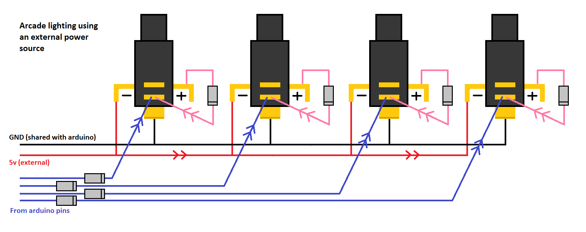

# Yuancon now has bright LEDs!!*
### *after a lot of modification and using an Arduino Leonardo instead of Yuan's STM32 based board

Current version: v1.1.2

The goal of this project was originally to swap out Yuan's STM32 board for an Arduino Leonardo due to the poor compatibility with IIDX Infinitas. At some point in the project I decided to go down the route of powering the LEDs externally like a Dao controller, rather than directly from the Leonardo. HID lighting doesn't interest me so much - superbright keys are priority!

#### External power / LEDs
As most Yuan owners know, the Yuancon's LEDs are pretty dim. This comes with the advantage of the controller only requiring one USB port, but due to the limited amount of power if can draw while still providing consistent power to the PCB, the LED brightness gets sacrificed. This was overcome here by installing a secondary USB port in the controller, and use the existing port to be a dedicated port for providing power. A hole was drilled in the Yuancon's casing next to the existing USB port, and a Neutrik reversable USB socket was installed to act as an external port to the Arduino inside. 

I will add pictures soon showing the installation!

Here is a crude MS paint diagram demonstrating the concept of powering arcade LEDs externally:

Only four buttons are shown - this would obviously be the 7 keys, and however many more buttons you want to add to the controller. I'm currently using the 7 keys and 4 option buttons (plus the turntable LED ring), and there is no dimming at all when all buttons are pressed.

#### Code for maximum Infinitas compatibility 

The code is stripped out and modified version of LizardBean's code (https://github.com/lizardbeans/iidxsdvx). The LED related code has been removed, and it has been tweaked to work as well as possible with the encoder used in Yuan's controllers - at the moment it works flawlessly, but is very sensitive. In the future I may try and implement some code to enable the ability to adjust this sensitivity, or how much you have to turn the turntable before it fires. This will mainly be for preference - I haven't had any complaints yet! 

There are also now two boot modes for either analogue turntable, or digital for use with LR2. Default boot of Arduino puts the turntable in analogue mode. This is perfect for IIDX Infinitas, or any other application that has true analogue turntable support. Hold key 7 while plugging in controller to enable Digital TT mode - turntable will report xAxis left/right, then return to 0 position. Ideal for LR2, but could do with some further tweaking to prevent misfires.
 
Finally, Veroxzik has made an amazing library for spoofing the controller hardware ID, allowing the Arduino to identify as Konmai's Premium Best controller in Windows. This means absolute compatibility with IIDX Infinitas!
Check it out here: https://github.com/veroxzik/arduino-konami-spoof